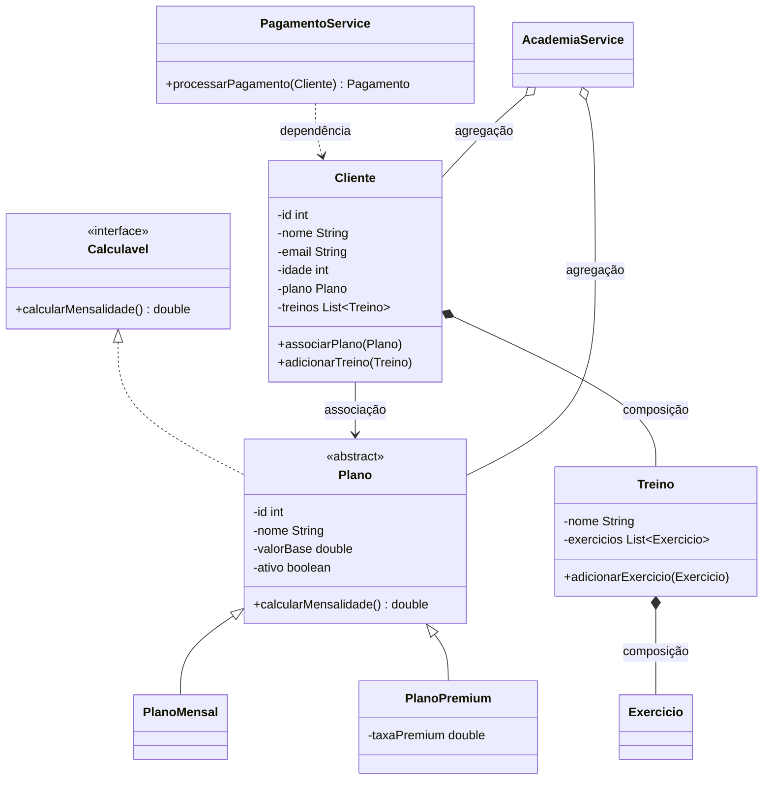

# Diagrama de classes

```mermaid
classDiagram
    class Calculavel {
      <<interface>>
      +calcularMensalidade() double
    }
    class Plano {
      <<abstract>>
      -id int
      -nome String
      -valorBase double
      -ativo boolean
      +calcularMensalidade() double
    }
    class PlanoMensal
    class PlanoPremium {
      -taxaPremium double
    }
    class Cliente {
      -id int
      -nome String
      -email String
      -idade int
      -plano Plano
      -treinos List~Treino~
      +associarPlano(Plano)
      +adicionarTreino(Treino)
    }
    class Treino {
      -nome String
      -exercicios List~Exercicio~
      +adicionarExercicio(Exercicio)
    }
    class Exercicio
    class PagamentoService {
      +processarPagamento(Cliente) Pagamento
    }
    class AcademiaService

    Calculavel <|.. Plano
    Plano <|-- PlanoMensal
    Plano <|-- PlanoPremium
    Cliente --> Plano : associação
    Cliente *-- Treino : composição
    Treino *-- Exercicio : composição
    PagamentoService ..> Cliente : dependência
    AcademiaService o-- Cliente : agregação
    AcademiaService o-- Plano : agregação
```
