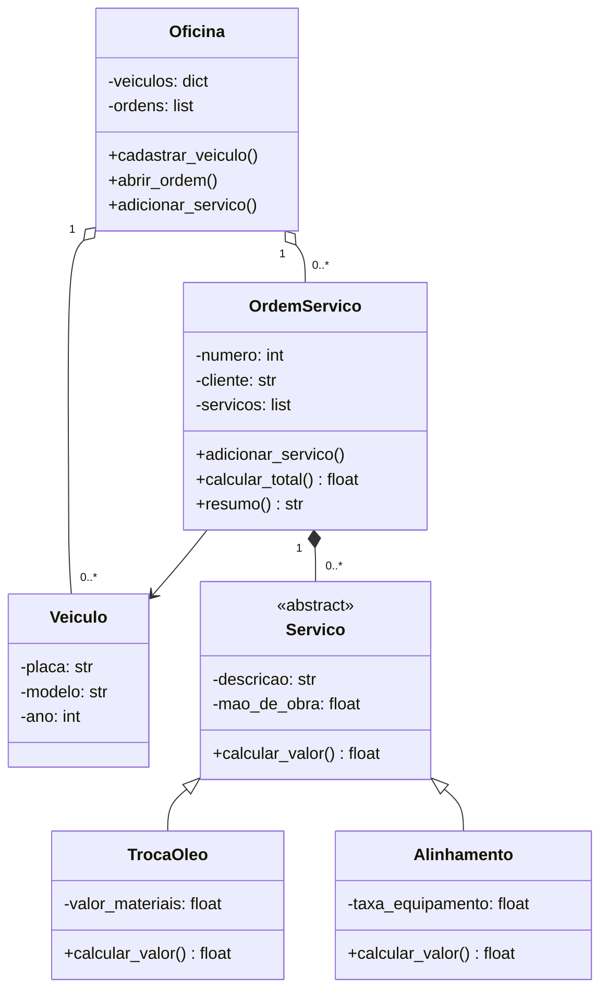

# Diagrama de classes

```mermaid
classDiagram
    class Veiculo {
      -placa: str
      -modelo: str
      -ano: int
    }
    class Servico {
      <<abstract>>
      -descricao: str
      -mao_de_obra: float
      +calcular_valor() float
    }
    class TrocaOleo {
      -valor_materiais: float
      +calcular_valor() float
    }
    class Alinhamento {
      -taxa_equipamento: float
      +calcular_valor() float
    }
    class OrdemServico {
      -numero: int
      -cliente: str
      -servicos: list
      +adicionar_servico()
      +calcular_total() float
      +resumo() str
    }
    class Oficina {
      -veiculos: dict
      -ordens: list
      +cadastrar_veiculo()
      +abrir_ordem()
      +adicionar_servico()
    }
    Servico <|-- TrocaOleo
    Servico <|-- Alinhamento
    OrdemServico --> Veiculo
    OrdemServico "1" *-- "0..*" Servico
    Oficina "1" o-- "0..*" Veiculo
    Oficina "1" o-- "0..*" OrdemServico
```

